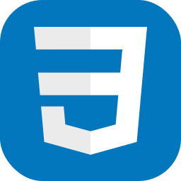
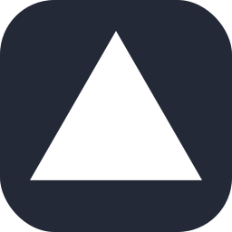
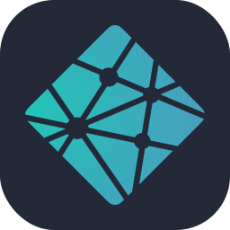

🚀 Full-Stack Developer | I build production ready Softwares

## 🎯 Featured Projects

**GymFlow** - Gym Management Software
- Built with  Next.js, TypeScript, Node.js, Express.js, PostgreSQL, Prisma, Tailwind CSS, REST APIs, Cloudinary
- Helps Gym Owners to handle day-to-day tasks, and save time and money.
- 🔥 [Live Demo](https://gymfloww.in/)

**[Mystry Messages](https://github.com/vaghmarelazy/Mystry-messages)** - Anonymous feedback platform
- Built with TypeScript & Next.js
- Real-time message handling
- 🔥 [Live Demo](https://mystry-messages-delta.vercel.app/)

<!--
## 🧑‍💻 Tech Stack (Expended)

<code></code>
<code></code>
<code></code>
<code></code>
<code></code>
<code></code>
<code></code>
<code></code>
<code></code>
<code></code>
<code></code>
<code></code>
<code></code>
<code></code>

<!-- <code></code> -->
## 📊 GitHub Stats
|  |  |
| -------------------------------------------------------------------------------------------------------------------------------------------------------------------------------------------------------- | --------------------------------------------------------------------------------------------------------------------------------------------------------------------------------------------------------------- |

## 🤝 Let's Connect
- 💼 LinkedIn: [linkedin.com/in/lazy-developer](linkedin.com/in/lazy-developer)
- 📧 Email: [rupeshvaghmare1@gmail.com](mailto:rupeshvaghmare1@gmail.com)
- 🌐 Portfolio: [thelazydeveloper.netlify.app](https://thelazydeveloper.netlify.app/)
<!---->

<!--
**vaghmarelazy/vaghmarelazy** is a ✨ _special_ ✨ repository because its `README.md` (this file) appears on your GitHub profile.

Here are some ideas to get you started:

- 🔭 I’m currently working on ...
- 🌱 I’m currently learning ...
- 👯 I’m looking to collaborate on ...
- 🤔 I’m looking for help with ...
- 💬 Ask me about ...
- 📫 How to reach me: ...
- 😄 Pronouns: ...
- ⚡ Fun fact: ...
-->
